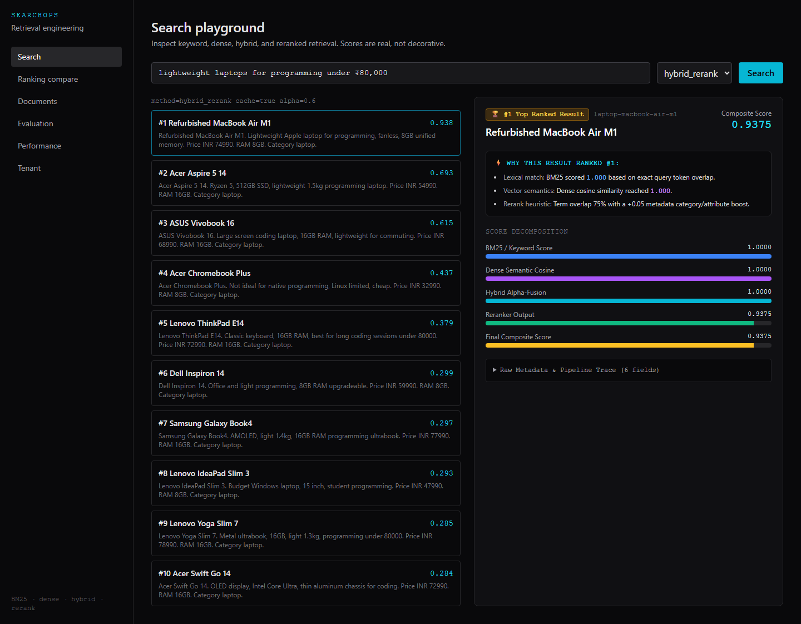
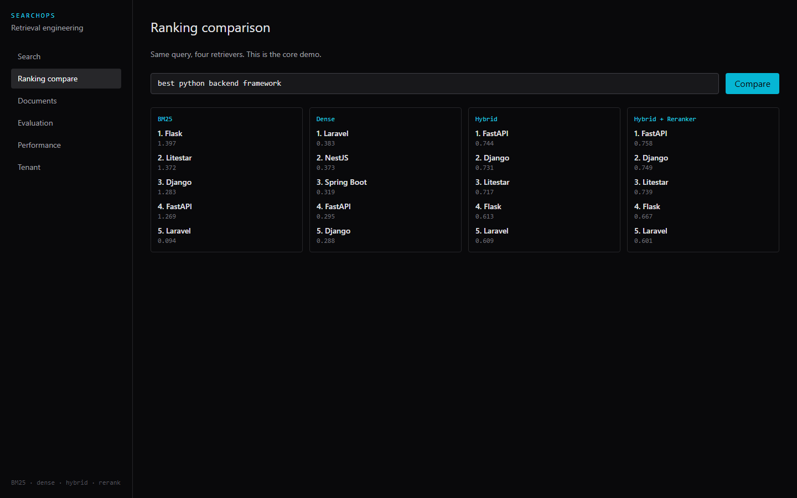
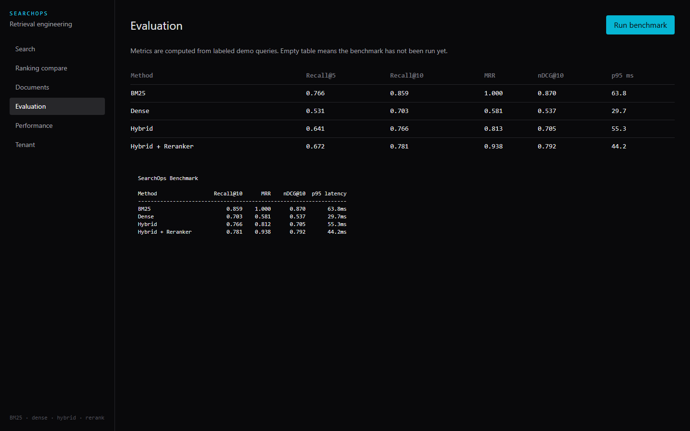
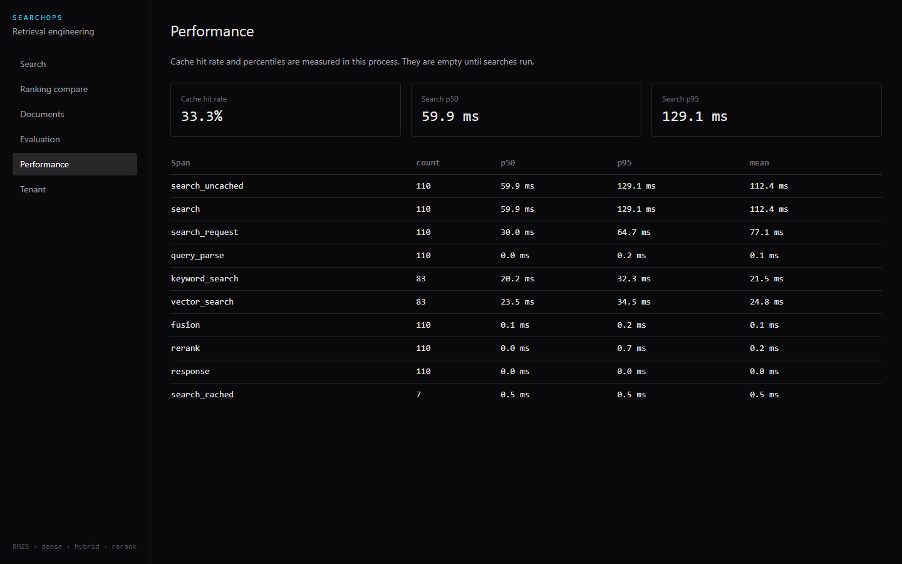
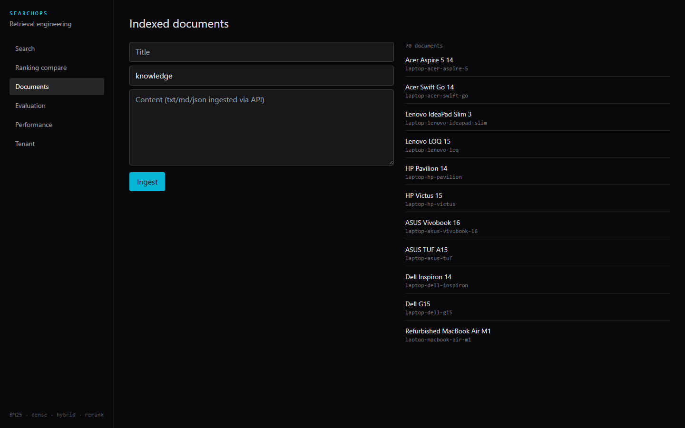
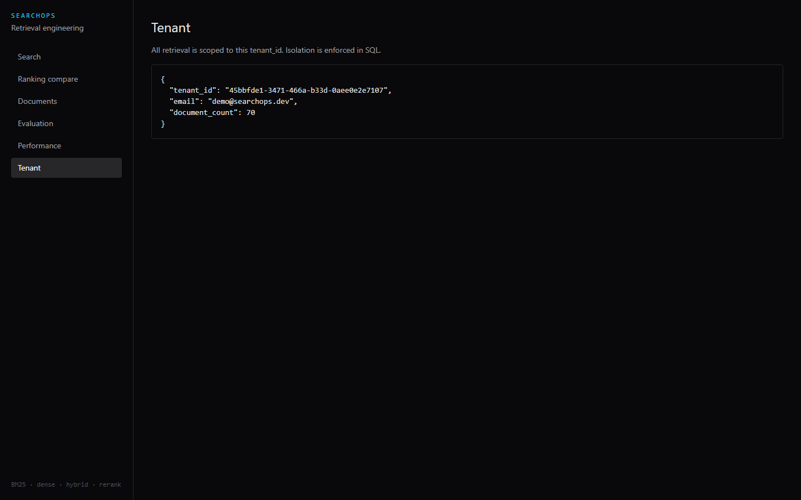

# SearchOps

### Information Retrieval, Hybrid Ranking & Search Engineering Platform

SearchOps is **not** a generic RAG chatbot. It is a full-stack retrieval engineering platform designed to ingest collections of documents/products, execute competing retrievers (BM25, Dense Cosine, Hybrid $\alpha$-fusion, and Reranking), inspect multi-stage score decompositions in real-time, and systematically benchmark ranking quality with standard IR metrics (Recall@K, MRR, nDCG@10, and latency percentiles).

---

## Visual Tour

| **Search Playground & Ranking Inspector** | **Retriever Ranking Comparison** |
|:---:|:---:|
|  |  |
| *Real-time lexical, dense, hybrid, and rerank score inspection with "Why this ranked #1" decomposition* | *Side-by-side query execution across Keyword (BM25), Dense, Hybrid, and Reranked algorithms* |

| **IR Evaluation & Benchmark Suite** | **Performance Traces & Latency (p50/p95)** |
|:---:|:---:|
|  |  |
| *Automated evaluation measuring Recall@5, Recall@10, MRR, and nDCG@10 against labeled test cases* | *Stage-by-stage latency traces, cache hit/miss status, and query understanding logs* |

| **Document Catalog & Multi-Format Ingestion** | **Multi-Tenant Administration** |
|:---:|:---:|
|  |  |
| *JSON, CSV, Markdown, and TXT chunk ingestion with metadata attributes and tenant isolation* | *Tenant partitioning, API credentials, and query isolation settings* |

---

## Key Features

1. **Multi-Algorithm Retrieval Engine**:
   - **Keyword (BM25)**: Lexical exact token matching with term frequency / inverse document frequency scoring.
   - **Dense (Vector Cosine)**: Semantic similarity supporting deterministic hashed embeddings, local Hugging Face `all-MiniLM-L6-v2` transformers, or cloud providers (OpenAI / Gemini).
   - **Hybrid Fusion**: Convex combination linear score fusion:
     $$\text{Score}_{\text{hybrid}} = \alpha \cdot \text{Score}_{\text{dense}} + (1 - \alpha) \cdot \text{Score}_{\text{BM25}}$$
   - **Reranker Pipeline**: Multi-factor candidate reranking with term overlap boost, title hits, and metadata attribute weighting (or local Cross-Encoder).

2. **"Why this result ranked #1" Inspector**:
   - Real-time score decomposition breaking down Lexical %, Vector Semantics %, Hybrid fusion weighting ($\alpha$), and Reranker boosts.
   - Deep pipeline trace including raw metadata, normalized tokens, and query understanding filters.

3. **Information Retrieval Benchmark Suite**:
   - Automated evaluation harness computing **Recall@5**, **Recall@10**, **MRR (Mean Reciprocal Rank)**, **nDCG@10 (Normalized Discounted Cumulative Gain)**, **p50**, and **p95** latency percentiles.

4. **Multi-Tenant Security & Reliability**:
   - Strict tenant partitioning on all SQL queries and vector indices.
   - JWT authentication and API key management.
   - Graceful resilience: Redis down $\to$ in-memory fallback; reranker failure $\to$ hybrid fallback; missing keys $\to$ offline hashed/local models.

---

## Real Benchmark Results

SearchOps includes reproducible evaluation benchmarks comparing deterministic hashed embeddings against lightweight local transformer embeddings (`sentence-transformers/all-MiniLM-L6-v2`) on identical labeled evaluation sets (`evals/demo_cases.json`).

### 1. Transformer Embeddings (`all-MiniLM-L6-v2`)
*Command: `python -m searchops.cli eval --provider huggingface --reseed`*

| Retrieval Method | Recall@5 | Recall@10 | MRR | nDCG@10 | p50 Latency | p95 Latency |
|:---|:---:|:---:|:---:|:---:|:---:|:---:|
| **BM25 (Keyword)** | 0.766 | 0.859 | 1.000 | 0.870 | 18.1 ms | 25.7 ms |
| **Dense (MiniLM Cosine)** | 0.734 | 0.812 | 0.938 | 0.823 | 31.1 ms | 32.7 ms |
| **Hybrid ($\alpha=0.6$)** | 0.734 | 0.859 | 1.000 | 0.876 | 44.8 ms | 79.8 ms |
| **Hybrid + Reranker** | **0.797** | **0.922** | **1.000** | **0.893** | 45.3 ms | 66.5 ms |

> **Analysis**: When semantic transformer embeddings are used, Dense retrieval reaches high quality (Recall@10 = 0.812, MRR = 0.938), and combining Dense + BM25 + Reranking yields the highest overall retrieval performance (Recall@10 = **0.922**, nDCG@10 = **0.893**).

---

### 2. Baseline Embeddings (Deterministic Hashed N-Grams)
*Command: `python -m searchops.cli eval --provider hashed --reseed`*

| Retrieval Method | Recall@5 | Recall@10 | MRR | nDCG@10 | p50 Latency | p95 Latency |
|:---|:---:|:---:|:---:|:---:|:---:|:---:|
| **BM25 (Keyword)** | 0.766 | 0.859 | 1.000 | 0.870 | 10.2 ms | 18.1 ms |
| **Dense (Hashed)** | 0.531 | 0.703 | 0.581 | 0.537 | 13.5 ms | 17.2 ms |
| **Hybrid ($\alpha=0.6$)** | 0.641 | 0.766 | 0.812 | 0.705 | 20.1 ms | 29.3 ms |
| **Hybrid + Reranker** | 0.672 | 0.781 | 0.938 | 0.792 | 18.5 ms | 19.2 ms |

> **Note on Hashed Embeddings**: Dense search naturally underperforms BM25 when using zero-dependency hashed n-grams. This is intentional: it guarantees reproducible, offline testing without paid API keys or massive weights while making ranking differences immediately apparent in the inspector.

---

## Architecture Overview

```
[Browser / Next.js 14 App Router]
        │
        ▼ (JWT + Tenant-Id Header)
[FastAPI Backend Application]
        ├─► [Query Understanding Engine] (Filters, price ranges, attributes)
        │
        ├──► [Lexical BM25 Retriever]  ──────┐
        │                                    ▼
        ├──► [Dense Vector Retriever] ──► [Linear Hybrid Fusion] (α)
        │                                    │
        │                                    ▼
        │                            [Reranker Engine] (Cross-Encoder / Heuristic)
        │                                    │
        ▼                                    ▼
[Database / Storage Layer]           [Ranked Search Hits with Stage Breakdown]
   ├─► PostgreSQL / SQLite (Documents, Chunks, Evaluations)
   ├─► Redis Cache (Query + Top-K Caching with In-Memory Fallback)
   └─► Observability Traces (p50/p95, Latency Breakdown)
```

For complete architectural details, see [docs/ARCHITECTURE.md](docs/ARCHITECTURE.md).

---

## Quickstart & Local Setup

### Prerequisites
- **Python**: 3.11+
- **Node.js**: 20+

### 1. Backend Setup
```bash
cd apps/api

# Create and activate virtual environment
python -m venv .venv
# Windows: .venv\Scripts\activate
# Unix/macOS: source .venv/bin/activate

# Install dependencies
pip install -e ".[dev]"

# Set environment and start FastAPI
set DATABASE_URL=sqlite+aiosqlite:///./searchops.db
set EMBEDDING_PROVIDER=hashed
set DEMO_SEED=true
python -m uvicorn searchops.main:app --reload --port 8000
```

### 2. Frontend Setup
```bash
cd apps/web
npm install
npm run dev
```

Open [http://localhost:3000](http://localhost:3000). The demo tenant and catalog are seeded automatically on first start.
- **Demo Login**: `demo@searchops.dev`
- **Demo Password**: `demo-password`
- **API Docs**: [http://localhost:8000/docs](http://localhost:8000/docs)

---

## Docker Compose Setup

Run the full stack with PostgreSQL (pgvector image), Redis, FastAPI, and Next.js:

```bash
docker compose up --build
```

- **Next.js Web**: `http://localhost:3000`
- **FastAPI Backend**: `http://localhost:8000`
- **Health Checks**: `http://localhost:8000/health`

---

## Testing & Quality Assurance

SearchOps is covered by automated unit, integration, and end-to-end tests:

### 1. Backend Pytest Suite
```bash
cd apps/api
python -m pytest -q
# Result: 18 passed in 6.77s
```

### 2. Backend Linting
```bash
cd apps/api
python -m ruff check searchops tests
# Result: All checks passed!
```

### 3. Frontend Typecheck & Build
```bash
cd apps/web
npm run lint
npm run build
# Result: ✓ Compiled successfully, 6 pages built statically
```

### 4. Playwright End-to-End Test
```bash
cd apps/web
npx playwright test
# Result: 2 passed (2.0s)
# Covers: login -> search query -> results render -> inspect score breakdown
```

---

## Engineering Tradeoffs & System Decisions

- **BM25 vs. Dense**: BM25 excels at specific SKU numbers, model names, and exact keywords. Dense vectors excel at synonym matching, paraphrases, and fuzzy conceptual queries. Hybrid fusion gives the best of both.
- **Tenant Isolation**: Every SQL query and chunk retrieval strictly enforces `WHERE tenant_id = :tenant_id`. Documents and chunks belonging to one tenant are never visible or accessible to another.
- **Fail-Open Resilience**: If Redis is unavailable or fails, SearchOps immediately falls back to an in-memory TTL cache without crashing. If an advanced reranker or external embedding API fails, the pipeline degrades gracefully to hybrid ranking.
- **Zero-Dependency vs. Foundation Models**: SearchOps provides a unified provider interface (`EmbeddingProvider` ABC). Developers can test locally with zero API keys (`hashed`), run high-accuracy local models (`all-MiniLM-L6-v2`), or connect production cloud APIs (`OpenAI` / `Gemini`) with simple environment variables.

---

## Documentation Directory

- [docs/ARCHITECTURE.md](docs/ARCHITECTURE.md): System architecture, components, data models, and request lifecycle.
- [docs/SEARCH.md](docs/SEARCH.md): Retrieval math, BM25 scoring, dense cosine similarity, hybrid fusion, and reranking logic.
- [docs/EVALUATION.md](docs/EVALUATION.md): IR evaluation methodology, Recall@K, MRR, nDCG@10 formulas, and benchmark execution.
- [docs/API.md](docs/API.md): Full REST API endpoint documentation with example requests and responses.
- [docs/LOCAL_DEVELOPMENT.md](docs/LOCAL_DEVELOPMENT.md): Step-by-step clean-machine guide for local development and debugging.
- [docs/DECISIONS.md](docs/DECISIONS.md): Architectural Decision Records (ADRs) and engineering rationale.

---

## License

MIT License. Built for modern retrieval and search engineering showcases.
